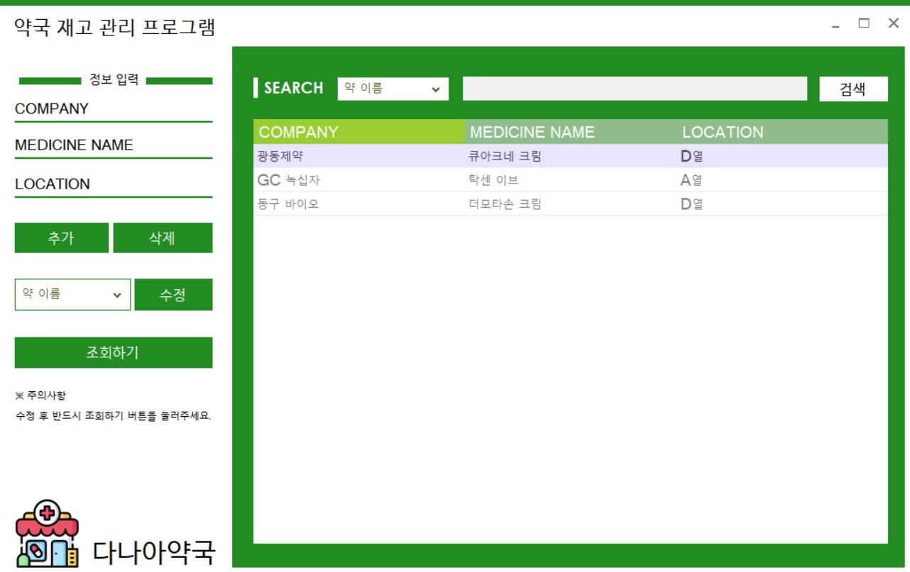

# PharmacyManagement
약국 재고 관리 프로그램(C#)
 
 
## 🖥️ 프로젝트 소개
약국에 있는 재고를 관리하는 프로그램입니다.
 
 
## 📆 개발 기간
* 23.06.26 ~ 23.07.09  
## ⚙️ 개발 환경
- `C#`
- **IDE** : Visual Studio 2022
- **Framework** : .Net Framework 4.7.2
- **Database** : SQLite DB
   
   
## 📌 주요 기능 
#### 1. 재고 추가 및 삭제
- 제약회사명, 약(재고) 이름, 위치를 입력하고 DB에 추가
- 해당 재고가 없을 때 DB에서 삭제
#### 2. 재고 위치 검색
- 제약회사 이름, 약(재고) 이름 중에서 선택해서 검색 가능
#### 3. 재고 수정 및 조회
- 재고에 대한 정보 수정 및 조회 가능  
## 🔎 ScreenShot

